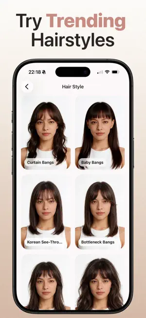
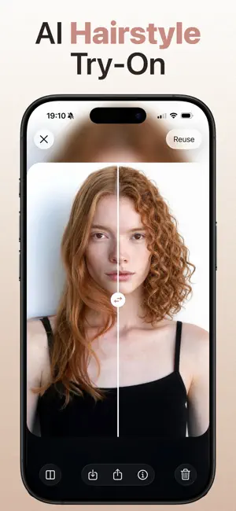
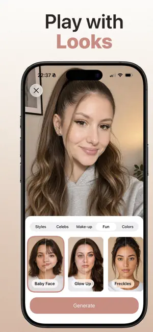
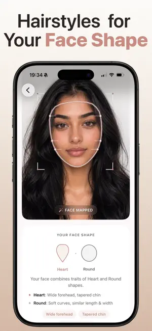

# Hair Studio

[Hair Studio: Hairstyle Try On](https://apps.apple.com/app/hair-studio-hairstyle-try-on/id6761934608) on the iOS App Store.

Try a haircut, hair color, celebrity look, or makeup before you make a real change. Take a portrait or choose one from Photos. Then select a style and compare the result with the original photo.

<p>
  
  
  
  
</p>

This repository is a curated public snapshot of the production iOS client. It is not open source. Image generation runs on a private backend that is not included here. Public updates are selective. See [SNAPSHOT.md](./SNAPSHOT.md).

## What this client solves

**Phone photos are large, and the model charges for the data it receives.** A photo from the camera is often 8 to 10 MB. Sending the full photo uses tokens and bandwidth for details that do not improve the result. After capture, `prepareDraftPhoto` finds the face and crops a 2:3 frame around it. It reduces the image to a maximum size of 1024 by 1536 pixels and saves it as a JPEG with quality 0.9. Most prepared photos are smaller than 1 MB and often smaller than 500 KB. This smaller file is converted to base64 and sent to the API.

**A bad photo wastes a generation.** The result will not be useful when the photo has no face, several people, or part of the face outside the frame. Live face detection controls the camera button and shows one of three states: `No face`, `Too many faces`, or `Face out of frame`. A box shows which face the app detected. The app checks the photo again after capture or after it is selected from the library. It accepts the photo only when one complete face is visible.

**Generation takes time.** SQLite and local files let the app show a pending result at once. On iOS, a background task uses `beginBackgroundTask` to keep the request active when the user leaves the app. A lock prevents duplicate requests. The progress bar reaches 99% in about 12 seconds. When the result is ready, the app loads it before showing it to the user.

**Authentication can fail.** Device JWTs expire, and App Attest or DeviceCheck can reject a token. The app stores valid tokens for a short time. If several requests need a new token, they share the same refresh operation. Some failures get one retry. An `invalid_token` error removes the saved access token. An `unknown_device_key` error resets the device session. A `device_check_invalid` error creates new DeviceCheck tokens before the retry. The app shows a clear message for network, DeviceCheck, and App Attest errors.

**The app also handles reuse, consent, and review prompts.** A user can reuse the same photo with another style. Consent for image processing has a version number. When the policy version changes, the app asks for consent again. The app allows no more than three native review requests per year and waits before asking again.

Results are stored on the device in SQLite and local files. The app supports English and Polish. It uses separate native toolbars for iOS and Android.

## Run locally

This project uses pnpm 11. It needs a native development build because Vision Camera and DeviceCheck do not work in Expo Go.

```sh
corepack enable
pnpm install
cp .env.local.example .env.local
```

```sh
pnpm ios      # macOS with Xcode
pnpm android  # Android SDK
```

If a compatible development build is already installed, `pnpm start` is enough. Rebuild after changing native dependencies or configuration.

The example environment file uses a demo URL because the private generation backend is not included in this repository. The catalog, camera, face scan, and sample gallery work without it. Starting image generation shows a network error by design.

When the Looks tab opens with no ready items, it seeds three samples so the preview and before/after slider have something to open.

## Checks

```sh
pnpm test
pnpm check-all
```

`check-all` runs formatting, linting, Expo dependency checks, Expo Doctor, and tests. GitHub Actions runs formatting, linting, and tests on pushes and pull requests targeting `main`.
